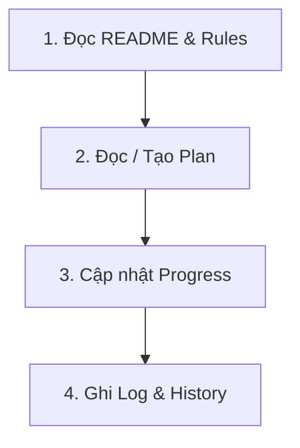

# 📚 Hệ Thống Quản Lý Không Gian Làm Việc (Workspace Management)

Hệ thống `my_workspace` được thiết kế nhằm chuẩn hóa quy trình làm việc, theo dõi tiến độ, lưu vết lịch sử và nhật ký kỹ thuật cho các dự án phát triển phần mềm và AI Agent.

---

## 📁 1. Cấu Trúc Thư Mục

```text
my_workspace/
├── README.md                 # Hướng dẫn tổng quan & quy trình làm việc chung
├── rules.md                  # Bộ quy tắc hành vi và nguyên tắc làm việc cốt lõi
├── plans/                    # Quản lý kế hoạch, thiết kế kiến trúc và lộ trình
│   ├── README.md
│   └── TEMPLATE_plan.md
├── progress/                 # Theo dõi tiến độ thực hiện và checklist công việc
│   ├── README.md
│   └── TEMPLATE_progress.md
├── history/                  # Tóm tắt phiên làm việc, lưu trữ ngữ cảnh bàn giao
│   ├── README.md
│   └── TEMPLATE_history.md
├── logs/                     # Nhật ký thực thi chi tiết, benchmark và xử lý lỗi kỹ thuật
│   ├── README.md
│   └── TEMPLATE_log.md
└── docs/                     # Tài liệu và báo cáo chuyên sâu
    └── reports/              # Lưu trữ báo cáo tổng quan, phân tích kỹ thuật
        ├── README.md
        └── TEMPLATE_report.md
```

---

## 🏷️ 2. Quy Chuẩn Đặt Tên File

Mọi file tài liệu (ngoại trừ các file `README.md` và `TEMPLATE_*.md`) phải tuân theo cấu trúc đặt tên chuẩn:

- **Định dạng chung**: `vX.Y.Z_<YYYY-MM-DD>_<topic>_<type>.md` hoặc `YYYY-MM-DD_<topic>_<type>.md`
  - `vX.Y.Z`: Phiên bản (Semantic Versioning, ví dụ: `v1.0.0`, `v1.1.0`).
  - `<YYYY-MM-DD>`: Ngày tạo file theo định dạng chuẩn ISO (ví dụ: `2026-08-18`).
  - `<topic>`: Chủ đề/nội dung ngắn gọn viết thường nối bằng dấu gạch dưới (ví dụ: `production_rag`, `hybrid_search`, `reranking`, `project_overview`).
  - `<type>`: Loại tài liệu (`plan`, `progress`, `history`, `log`, `report`).

> **Ví dụ**:
> - `plans/v1.0.0_2026-08-18_production_rag_plan.md`
> - `progress/v1.0.0_2026-08-18_production_rag_progress.md`
> - `history/2026-08-18_session_summary.md` hoặc `history/v1.0.0_2026-08-18_production_rag_history.md`
> - `logs/v1.0.0_2026-08-18_production_rag_log.md`
> - `docs/reports/v1.0.0_2026-08-18_project_overview_report.md`

---

## 📝 3. Quy Chuẩn YAML Frontmatter

Mọi file tài liệu trong các thư mục con (ngoại trừ `README.md` và `TEMPLATE_*.md`) **bắt buộc** phải khai báo khối YAML Frontmatter ở đầu file để hỗ trợ phân loại và tra cứu:

```yaml
---
version: "1.0.0"
date: "YYYY-MM-DD"
type: "plan | progress | history | log | report"
status: "DRAFT | PLANNED | IN_PROGRESS | COMPLETED | CANCELLED"
author: "Tên người tạo hoặc AI Agent"
target_component: "Tên thành phần / Module"
tags: ["tag1", "tag2"]
summary: "Tóm tắt ngắn gọn 1-2 câu về nội dung file."
---
```

---

## 🔄 4. Quy Trình Làm Việc 4 Bước Của AI Agent

Khi bắt đầu một nhiệm vụ hoặc phiên làm việc mới, AI Agent và lập trình viên cần tuân thủ quy trình 4 bước tuần tự:



1. **Bước 1: Khởi động & Nắm bắt ngữ cảnh (Context Absorption)**
   - Đọc `my_workspace/README.md` và `my_workspace/rules.md` để nắm rõ quy tắc vận hành.
   - Xem qua `my_workspace/history/` gần nhất để tiếp nhận ngữ cảnh bàn giao.

2. **Bước 2: Lập & Đồng thuận Kế hoạch (Planning)**
   - Tạo hoặc cập nhật file kế hoạch trong `my_workspace/plans/` theo template chuẩn `TEMPLATE_plan.md`.
   - Phân tích kỹ thuật, làm rõ các giả định và thống nhất hướng tiếp cận trước khi viết code.

3. **Bước 3: Triển khai & Cập nhật Tiến độ (Execution & Progress Tracking)**
   - Khởi tạo/cập nhật checklist nhiệm vụ trong `my_workspace/progress/` theo `TEMPLATE_progress.md`.
   - Đánh dấu hoàn thành từng task, ghi nhận kịp thời các trở ngại phát sinh (blockers).

4. **Bước 4: Ghi Nhật ký & Bàn giao Ngữ cảnh (Logging & Handover)**
   - Ghi chi tiết kết quả thử nghiệm, benchmark, lỗi gặp phải và giải pháp xử lý vào `my_workspace/logs/` theo `TEMPLATE_log.md`.
   - Tổng kết phiên làm việc vào `my_workspace/history/` theo `TEMPLATE_history.md` để phục vụ bàn giao ngữ cảnh cho các phiên làm việc tiếp theo.
